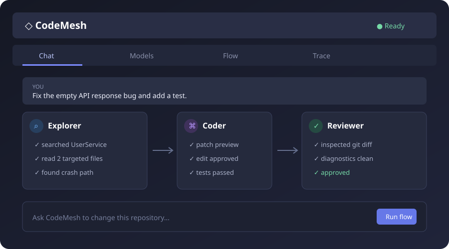

# CodeMesh

**A VS Code / Cursor coding-agent workbench for role-based, multi-model software engineering workflows.**



CodeMesh makes orchestration visible. Repository exploration, implementation, and review can use different models while sharing a controlled typed-tool layer and an auditable execution trace.

## Why CodeMesh?

Most coding assistants present one model and one answer. CodeMesh separates the engineering workflow into replaceable logical roles:

```text
Explorer → Coder → Reviewer → Approved
             ↑          |
             └ revision ┘  (bounded)
```

- **Multi-model roles:** assign any configured endpoint independently to Explorer, Coder, and Reviewer.
- **Controlled tools:** Zod-validated search, reads, symbols, diagnostics, patches, and commands.
- **Selective context:** ripgrep and VS Code language services replace whole-repository prompting.
- **Reviewed edits:** every structured patch opens a VS Code diff and requires explicit approval.
- **Visible execution:** model calls, tool calls, edits, commands, and reviews stream into the Trace tab.
- **Local compatible:** one OpenAI-compatible adapter supports hosted gateways and local inference servers.

## Architecture

```text
React Webview ← typed bridge → Extension Host
                                 │
                         AgentRuntime
                    ┌────────────┼────────────┐
                 Models        Roles        Tools
                    └────────────┼────────────┘
                         FlowExecutor
                 Explorer → Coder → Reviewer
                                 │
                          TraceRecorder
```

See [docs/architecture.md](docs/architecture.md) for boundaries and sequence details.

## Install from source

Requirements: Node.js 20+, pnpm, ripgrep (`rg`), and VS Code 1.92+ or a compatible Cursor release.

```bash
pnpm install --frozen-lockfile
pnpm build
pnpm test
pnpm package
```

Install `codemesh-0.1.0.vsix` using **Extensions: Install from VSIX…**.

## Configure

1. Open the CodeMesh activity-bar view.
2. In **Models**, add an OpenAI-compatible base URL and model name.
3. Optionally enter an API key; VS Code stores it in `SecretStorage`.
4. Assign models to Explorer, Coder, and Reviewer.
5. Save, then run a task from **Chat**.

The endpoint must expose `POST {baseUrl}/chat/completions` and support OpenAI-style tool calls.

## Example workflow

Open [`examples/demo-project`](examples/demo-project) and ask:

> The UserService crashes when the API returns an empty response. Fix the bug and enable/add a test.

The extension searches the repository, proposes an approved diff, validates it, asks an independent Reviewer, and performs at most one revision by default. See [docs/demo.md](docs/demo.md).

## Project structure

```text
core/       provider, roles, tools, flow, trace, runtime
extension/  VS Code activation, configuration, IDE-native tools
webview/    React workbench (Chat, Models, Flow, Trace)
tests/      deterministic unit tests with mocked role execution
examples/   intentionally imperfect demo repository
docs/       architecture and demo guide
```

## Design decisions

- Models are replaceable; roles are logical.
- Tools are typed functions, not prompt conventions.
- Flow definitions do not depend on provider implementations.
- File access stays inside the workspace.
- Commands run without a shell, from an allowlist, with time and output bounds.
- V0 deliberately avoids embeddings, vector databases, external orchestration frameworks, and cloud services.

## Roadmap

- Streaming responses and richer patch staging
- Automatic project validation detection
- Configurable role prompts and model fallback
- Repository maps and Tree-sitter intelligence
- User-defined tools, MCP, custom roles, and reusable workflows
- Evaluation metrics for task success, test pass rate, latency, and cost

## License

MIT

## Development methodology

See the [AI-native development plan](docs/AI_WORKFLOW.md) for the verification and evaluation method.
