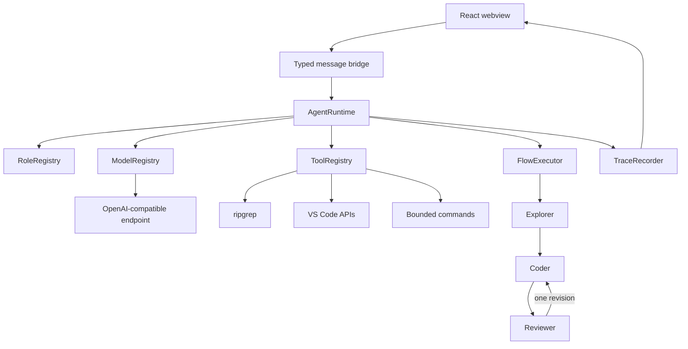

# Architecture

CodeMesh keeps model selection, logical roles, tools, workflow, and IDE integration separate. The extension host owns all privileged operations; the webview can only send typed messages.

## Trust boundaries

- Paths are workspace-relative and canonicalized before access.
- Explorer and Reviewer cannot edit files.
- Coder edits only through `apply_patch`, which opens a diff and requires approval.
- Commands use an executable allowlist, no shell, a timeout, and output limits.
- API keys live in VS Code `SecretStorage`, not settings JSON.
- Agent tool turns and reviewer loops are bounded.

## Runtime sequence

1. Explorer searches and reads only the context it needs.
2. Coder receives compact findings, edits through the patch tool, and validates.
3. Reviewer inspects the git diff, diagnostics, and tests.
4. A rejected review produces at most one default Coder revision.
5. Every meaningful action is published to the trace UI.
